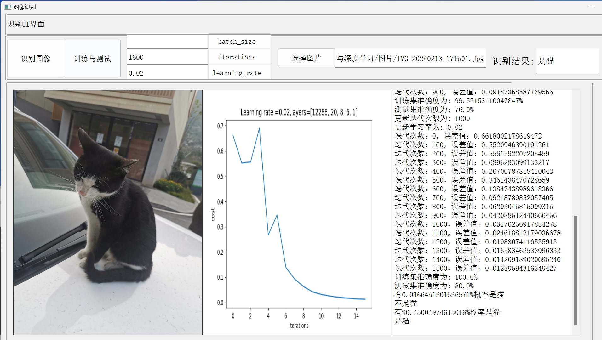

# Neural-Network-for-Cat-Recognition

For [Chinese Readme](./readme-cn.md).

This project gives the neural network code, UI page code, and comprehensive report of using neural network to identify cats. 
 
The project contains a total of three python files : lr _ utils.py, Deeplearningcat.py, UI.py. Among them, lr _ utils.py is given by the topic, which is used to parse the content of the training set and test set files ; deeplearningcat.py is a file for building a single-layer neural network model ; uI.py visualizes the experimental results and provides an interactive interface for users. 
 
First of all, the second week 's homework data set of [ Wu Enda 's after-school programming homework ] has 209 pictures as a training set and 50 pictures as a test set. Some of the pictures are cat pictures and some are not. The pixel size of each image is 64 * 64. Wu Enda converted these two image sets into training set and test set files : train _ catvnoncat.h5 ( training set ), test _ catvnoncat.h5 ( test set ). There are training set files, test set files and lr _ utils.py files in the known conditions given by the job. 
 
The experimental results are as follows : 
